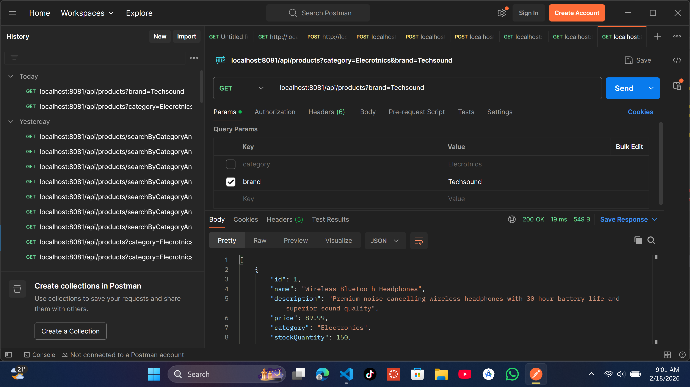
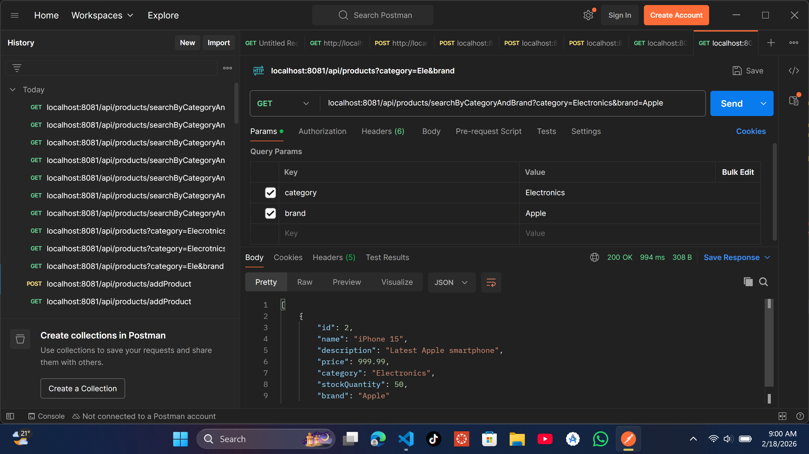

# WebTech Assignment 3 - E-commerce Project

## Student Information
- **Name:** Mushimiyumukiza Blaise
- **ID:** 26229

## Project Overview
This is an E-commerce application developed as part of Web Technology Assignment 3. The project implements a springboot RESTful API for managing products with advanced search capabilities.

## Features
- Product management (CRUD operations)
- Search products by brand
- Search products by category
- Search products by both brand and category
- RESTful API architecture

## Technologies Used
- Spring Boot
- Java
- REST API
- Maven/Gradle

## Screenshots

### Search by Brand

### Search by Category

### Search by Brand and Category

## API Endpoints
- `GET /api/products` - Get all products
- `GET /api/products/{id}` - Get product by ID
- `GET /api/products/brand/{brand}` - Search products by brand
- `GET /api/products/category/{category}` - Search products by category
- `GET /api/products/search?brand={brand}&category={category}` - Search by brand and category
- `POST /api/products` - Create new product
- `PUT /api/products/{id}` - Update product
- `DELETE /api/products/{id}` - Delete product

## Setup and Installation
1. Clone the repository
2. Navigate to project directory
3. Run `mvn clean install` or `gradle build`
4. Run the application: `mvn spring-boot:run` or `gradle bootRun`
5. Access the API at `http://localhost:8080`

## References
- [Spring Boot - GeeksforGeeks](https://www.geeksforgeeks.org/advance-java/spring-boot/)

## License
This project is created for educational purposes as part of WebTech Assignment 3.
